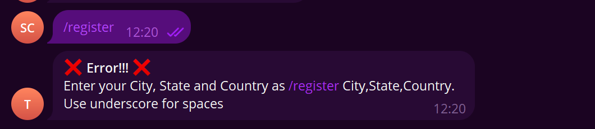

# Telegram Weather Bot

This bot provides you with the weather details of your location every morning. You can register yourself and request the weather on demand.
<br>
The Admin can Block/Unblock and Delete the users. Can use CRON type strings for scheduling the updates. The CRON string will be decoded and presented to the Admin for understanding.
<br>
The bot within itself uses CRON to schedule messages for all the unblocked users every morning.

# Setup

## Installation

```shell
git clone https://github.com/sakshamchhimwal/tg_bot.git
```

## Frontend

```shell
cd frontend
npm i
npm start
```

## Backend

```shell
cd backend
npm i
npm build
npm start
```

## Get API Key

1. Open https://t.me/BotFather
2. Make a new bot with `/newbot`
3. Choose a name for the bot here _saksham_weather_bot_
4. Get the API key
5. Configure the command as follows
    ```txt
    start - Start the Bot.
    register - Register yourself, /register City,State,Country. User _ for spaces if any.
    weather - Get the current weather details.
    ```
6. After registering go to the bot.

## Backend .env Setup
```shell
cd backend
touch .env
```
```txt
MONGO_DB_URL = XXXX
TELEGRAM_API_KEY = XXXX
WEATHER_API_KEY = XXXX
WEBHOOK_PROXY_URL = XXXX
WEBHOOK_RETURN_URL = "http://localhost:8000/events"
```

-   MONGO_DB_URL: [here](https://www.mongodb.com/docs/guides/atlas/cluster/)
-   TELEGRAM_API_KEY : The one obtained above
-   WEATHER_API_KEY = [here](https://www.weatherapi.com/)
-   WEBHOOK_PROXY_URL = [here](https://smee.io/)

## Screenshots

### Telegram

-   Running the bot on telegram
    
-   Invalid Registeration
    

### Admin Panel

-   Admin User Panel
    

-   Admin Schedule Panel
    
